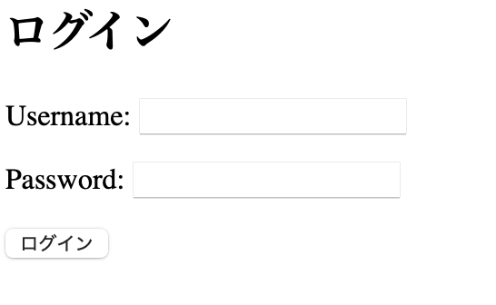
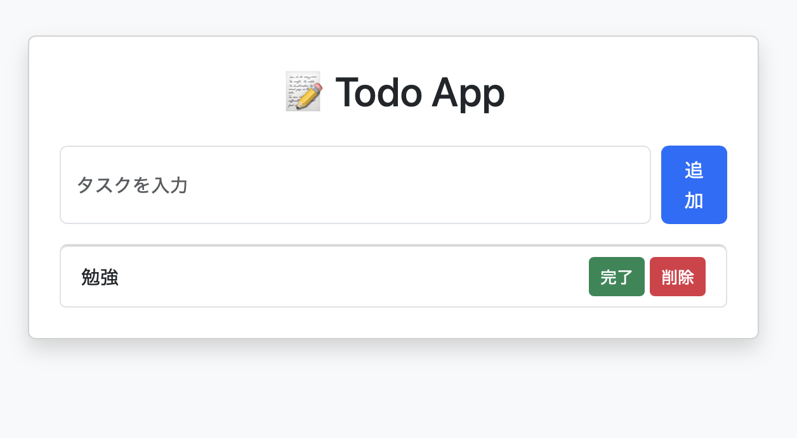

# Todo App（Django）

## 概要

Djangoで開発したTodo管理Webアプリです。

ユーザー認証機能を実装し、ログインしたユーザーごとにTodoデータを管理できるアプリケーションとして開発しました。

Todoの登録・一覧表示・完了状態変更・削除など、基本的なCRUD機能を実装しています。

---

## 使用技術

* Python 3.x
* Django 5.x
* PostgreSQL
* HTML / CSS
* Bootstrap 5
* Git / GitHub

---

## 実装機能

### ユーザー機能

* ログイン機能
* ログアウト機能
* ユーザーごとのTodo管理

### Todo機能

* Todo登録
* Todo一覧表示
* Todo完了 / 未完了切り替え
* Todo削除

### データベース

* PostgreSQLによるデータ管理
* Django ORMを利用したデータ操作
* Migrationによるデータベース変更管理

---

## 工夫した点

* Django標準の認証機能を利用してログイン機能を実装
* ユーザーとTodoを関連付け、ユーザー単位でデータを管理
* DjangoのMTVモデルに沿ったアプリケーション設計
* PostgreSQLと連携し、データを永続的に保存できる構成を実現
* Bootstrapを利用してシンプルで操作しやすいUIを作成
* GitHubでソースコード管理を行い、変更履歴を管理

---

## 開発で学んだこと

* Djangoの基本構成（Model / Template / View）
* CRUD処理の実装方法
* ORMを利用したデータベース操作
* Authentication（認証）機能の実装
* MigrationによるDB設計変更

---

## 今後追加予定

* Todo編集機能
* タスク期限設定機能
* 優先度管理機能
* 検索機能
* Docker環境構築
* REST API化

---

## 📷 画面イメージ

### ログイン画面

### Todo一覧画面

---

## 開発環境

* macOS
* Python
* Django
* PostgreSQL

---

## 作者

Yusakai

